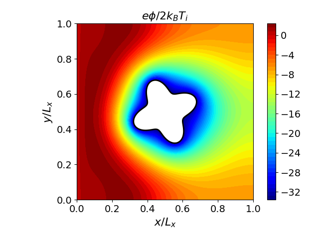

# Noise-Free Grid-based Vlasov Modeling of Plasma-Object Interactions via a Unified Ghost-Fluid Immersed-Boundary Method

Vlasolver is a high-performance C++ code for simulating the **Vlasov-Poisson system** on Cartesian grids with **complex boundaries** (objects embedded in the plasma domain). It is built on the [Kokkos](https://github.com/kokkos/kokkos) ecosystem for performance portability across CPUs and GPUs (CUDA, HIP, OpenMP, Serial, etc).

Plasma flow around a star!
|Number density (Ion) | Potential |
|--|--|
|  |  |

## Table of Contents

- [Overview](#overview)
- [Prerequisites](#prerequisites)
- [Installation](#installation)
  - [Option A: Apptainer (Recommended)](#option-a-apptainer-recommended)
  - [Option B: Manual Installation](#option-b-manual-installation)
- [Usage](#usage)
  - [Building](#building)
  - [Running an Example](#running-an-example)
  - [Available Examples](#available-examples)
  - [Running on an HPC Cluster](#running-on-an-hpc-cluster)
- [Python Post-Processing](#python-post-processing)
- [Advanced](#advanced)
  - [Development in Container](#development-in-container)
  - [Debugging](#debugging)
  - [Profiling](#profiling)
- [Contribution](#contribution)
- [References](#references)

## Overview

- **Second Order Accuracy**: Entire code is 2nd order accurate
- **Positivity Preserving**: A boundary-aware advection scheme with a modified positivity-preserving flux limiter[^xiong2014]
- **Immersed Boundary Method**: Vlasov solver uses IBM for complex boundary handling
- **Boundary-Capturing Poisson Solvers**:
  - 1st-order solver with red-black Gauss-Seidel iterative solving[^liu2000]
  - 2nd-order solver with GMRES & ILU preconditioner[^cho2019]
- **Unified Coupling**: Both Vlasov and Poisson solvers share the same Cartesian grid
- **Two simulation modes:**
  - **Full** — Multi-species code
  - **Reduced** — Single ion species with Boltzmann electrons
- **HDF5 output** in VTKHDF format for visualization with ParaView or the included Python tools.

## Prerequisites

- **Apptainer** (recommended) or manual installation of dependencies
- If using the provided container definition: an NVIDIA GPU with CUDA support. Kokkos also supports other backends (HIP, OpenMP, Serial, etc.) — you can customize `.devcontainer/kokkos_cuda.def` accordingly.

If you are using an HPC cluster, Apptainer is typically available as a module (`module load apptainer`).

## Installation

### Option A: Apptainer (Recommended)

Apptainer provides an isolated, reproducible environment with all dependencies pre-configured. This is the fastest way to get started.

**1. Install Apptainer:**

```bash
# On your own machine
sudo apt install apptainer

# On an HPC cluster
module load apptainer
```

**2. Build the container image:**

```bash
apptainer build .devcontainer/kokkos_cuda.sif .devcontainer/kokkos_cuda.def
```

This creates a SIF image containing CUDA 12.3, Kokkos 4.5, HDF5, HighFive, and all other required libraries. To use a different backend (e.g., HIP or CPU-only), edit `.devcontainer/kokkos_cuda.def` to adjust the Kokkos configuration before building. Building takes a few minutes the first time but only needs to be done once.

**3. You're ready.** Skip to [Usage](#usage).

### Option B: Manual Installation

All dependencies and their exact build recipes are documented in `.devcontainer/kokkos_cuda.def`. Use this file as your reference — you can modify it to use different Kokkos backends (swap `CUDA` for `HIP`, or use `OpenMP`/`Serial` only for CPU execution). The required libraries are:

| Dependency | Version | Notes |
|---|---|---|
| CUDA | ≥ 12.3 | GPU toolchain (optional — only needed for CUDA backend) |
| Kokkos | 4.5.01 | `CUDA`, `OpenMP`, `Serial` backends (customize backends as needed) |
| KokkosKernels | 4.5.01 | Sparse linear algebra |
| HDF5 | 1.14.5 | Parallel I/O |
| HighFive | 2.10.1 | C++ HDF5 wrapper |
| libinih | (system) | INI file parsing |

After installing dependencies, configure CMake with C++20 and the same Kokkos backends you intend to use:

```bash
cmake -B build -DCMAKE_BUILD_TYPE=Release -DCMAKE_CXX_STANDARD=20
cmake --build build
```

## Usage

### Building

```bash
# Configure (inside Apptainer)
apptainer run --nv .devcontainer/kokkos_cuda.sif cmake -B build

# Build all targets
apptainer run --nv .devcontainer/kokkos_cuda.sif cmake --build build
```

For a release build, add `-DCMAKE_BUILD_TYPE=Release` to the configure step.

### Running an Example

All examples take an input file as their only argument:

```bash
apptainer run --nv .devcontainer/kokkos_cuda.sif ./build/cylinder ./examples/cylinder/input.ini
```

Output is written in HDF5 format to the folder specified in the input file.

### Available Examples

| Example | Executable | Description |
|---|---|---|
| Cylinder | `./build/cylinder` | Plasma flow past a charged cylinder (reduced model, 1st-order Poisson) |
| Star | `./build/star` | Plasma flow past a star-shaped obstacle (reduced model, 2nd-order Poisson) |
| Sheath | `./build/sheath` | Plasma sheath formation (full two-species model) |
| Sheath (Rough Wall) | `./build/sheath_rough_wall` | Sheath with a rough wall boundary |
| Advection | `./build/advection` | Pure advection test — Gaussian blob around a cylinder (no Poisson) |
| Poisson | `./build/poisson` | Standalone Poisson interface problem with error analysis |

Each example has its own input file under `examples/<name>/input.ini`.

### Running on an HPC Cluster

A sample SLURM script:

```bash
#!/bin/bash
#SBATCH --gpus=1
#SBATCH --time=06:00:00
#SBATCH --job-name=vlasolver
#SBATCH --output=vlasolver_%j.out

module load apptainer

apptainer run --nv .devcontainer/kokkos_cuda.sif cmake -B build
apptainer run --nv .devcontainer/kokkos_cuda.sif cmake --build build
apptainer run --nv .devcontainer/kokkos_cuda.sif ./build/star ./examples/star/input.ini
```

See `run.sh` for a complete example.

## Python Post-Processing

The included Python package provides visualization and analysis tools for simulation output.

```bash
# Install with uv (recommended)
uv sync

# Or with pip
pip install -e .
```

Dependencies include `h5py`, `matplotlib`, `numpy`, `scipy`, and `sympy`. The package reads HDF5 output files and provides plotting and analysis utilities.

## Advanced

### Development in Container

The Apptainer image is immutable. To install additional tools (LSP servers, editors, etc.), create a writable overlay:

```bash
mkdir -p .devcontainer/overlay
apptainer shell --no-home --fakeroot --overlay .devcontainer/overlay .devcontainer/kokkos_cuda.sif
```

Once your tools are installed, use the overlay for daily development:

```bash
apptainer shell --nv \
  --no-home \
  --bind ~/.ssh \
  --overlay .devcontainer/overlay .devcontainer/kokkos_cuda.sif
```

The `dev.sh` script in the repository automates this.

### Debugging

Build with debug symbols:

```bash
apptainer run --nv .devcontainer/kokkos_cuda.sif cmake -DCMAKE_BUILD_TYPE=Debug -B build
apptainer run --nv .devcontainer/kokkos_cuda.sif cmake --build build
```

Then run with a debugger:

```bash
# CPU / host code
gdb ./build/cylinder

# CUDA kernel code
cuda-gdb ./build/cylinder
```

### Profiling

The container includes NVIDIA profiling tools. Use them to analyze GPU performance:

```bash
# Timeline profiling (Nsight Systems)
nsys profile --stats=true ./build/star ./examples/star/input.ini

# Kernel-level profiling (Nsight Compute)
ncu --set full ./build/star ./examples/star/input.ini
```

## Contribution

You are welcome to contribute! Fell free to
- Add new examples (e.g., new geometries, physics scenarios, or test cases).
- Implement new features (e.g., new boundary conditions, higher-order schemes, etc).
- Improve documentation or add new Python post-processing tools.
- Add apptainer definitions for other platforms (e.g., HIP for AMD GPUs, or CPU-only images).

For major changes, please open an issue first to discuss what you would like to change.

## References

[^xiong2014]: Xiong, T. et al. (2014). *A high-order positivity-preserving finite volume scheme for the Vlasov-Poisson equations.*

[^liu2000]: Liu, X. D. et al. (2000). *A boundary condition capturing method for Poisson's equation on irregular domains.* Journal of Computational Physics, 160(1), 151–178.

[^cho2019]: Cho, H. et al. (2019). *A second-order boundary condition capturing method for solving the elliptic interface problems on irregular domains.* Journal of Scientific Computing, 81, 1512–1535.

Additional reference papers are available in the `papers/` directory.
