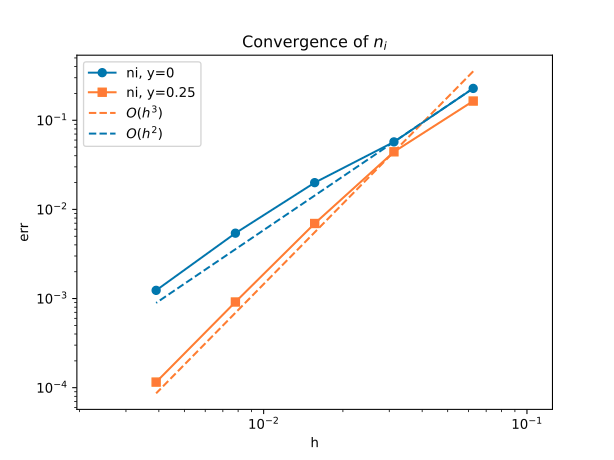

# Advection Convergence Test

Pure advection — the Vlasov equation without a Poisson solver. A Gaussian density pulse is initialized at $x = 0.2$ and advects with constant velocity $(v_x, v_y) = (0.1, 0)$ through a $[0,1] \times [0, 0.5]$ domain. A semi-circular immersed obstacle (center at $(0.375, 0)$, radius $0.125$) acts as a wall; the pulse simply flows around it since no electric field couples back.

All boundaries are periodic. This tests the advection operator and immersed boundary.

## Build

From the project root:

```bash
cmake -B build && cmake --build build
```

## Run

```bash
./examples/advection/run.sh
```

This sweeps resolutions $n = 16, 32, 64, 128, 256$.

## Verify

```bash
python examples/advection/convergence.py
```

The script computes the $L^\infty$ error against the exact advected solution and reports the convergence order.

## Results



- Convergence order is 3 in free space
- Convergence order is 2 with presents of boundary

## Plottings and Anime
After running `run.sh`
```bash
# plottings
python examples/advection/plottings.py
# generate anime
python examples/advection/make_anime.py
```
