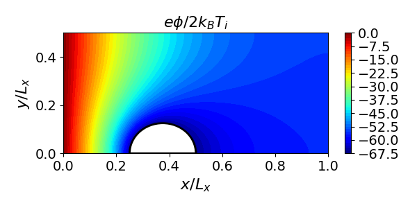
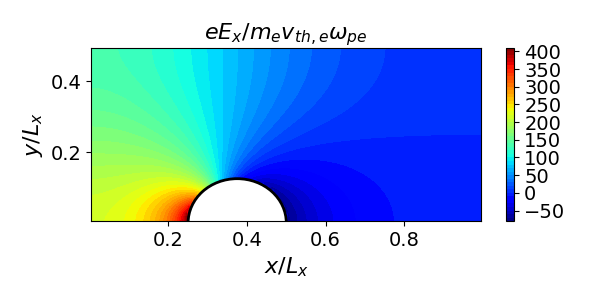
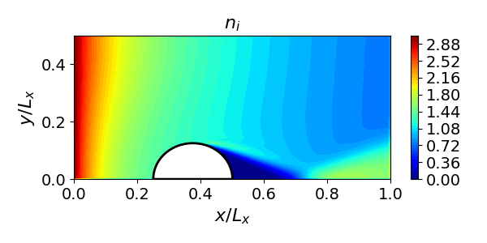
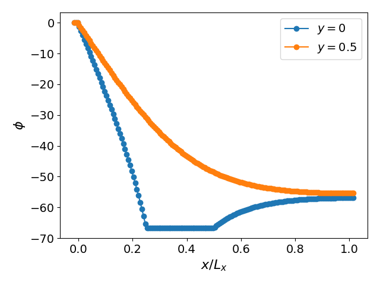
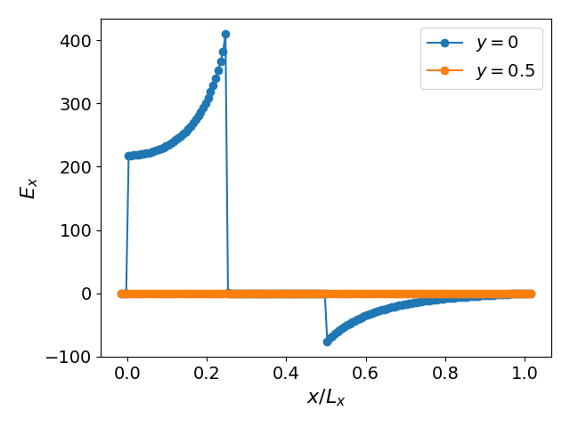

# Plasma Flow Past a Charged Cylinder

A Vlasov-Poisson simulation of a plasma flowing past a grounded, charged cylinder. Uses the **reduced model** (single ion species with Boltzmann electrons) and a 1st-order Poisson solver.

## Physics

- **Domain**: $[0, 1] \times [0, 0.5]$
- **Obstacle**: Circular cylinder centered at $(0.375, 0)$, radius $0.125$
- **Interior permittivity**: 1000 (conductor), exterior: 1 (plasma)
- **Cylinder potential**: held at a constant negative value
- **Boundary conditions**: Ions injected from the left (shifted Maxwellian with $v_x = 5$), reflective top/bottom, zero-inflow right
- **No initial particles** — the plasma builds up from the injection

## Build

```bash
cmake -B build && cmake --build build --target cylinder
```

## Run

```bash
build/cylinder examples/cylinder/input.ini
```

Parameters are configured in `input.ini`.

## Analysis

```bash
python examples/cylinder/plottings.py
```

## Results










