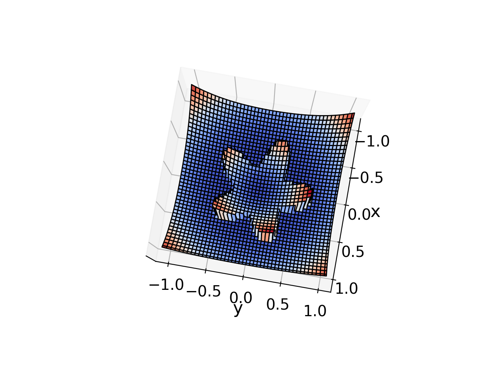
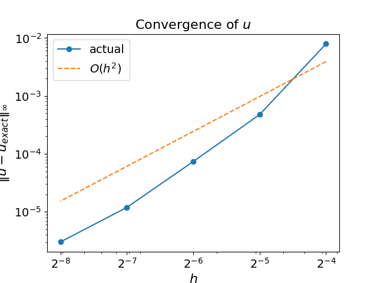
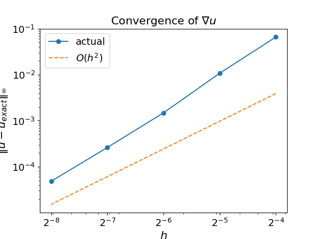

# Poisson Solver Convergence Test

Verification of the 2nd-order Poisson solver. Reproduces **Example 4.2** from Cho et al. (2019).

## Physics

A 2D Poisson equation on $[-1, 1]^2$ with a star-shaped immersed interface:

$$\phi(x,y) = r - (0.5 + 0.15 \sin(5\theta))$$

centered at $(\tfrac{\sqrt{5}}{50}, \tfrac{\sqrt{3}}{50})$. The dielectric permittivity is $1$ (outside) and $10$ (inside). Exact solutions for $u$ and the jump conditions are known analytically, so the numerical solution can be compared directly.

## Build

From the project root:

```bash
cmake -B build && cmake --build build --target poisson
```

## Run

```bash
./examples/poisson/run.sh
```

Sweeps resolutions $n = 16, 32, 64, 128, 256$.

## Verify

```bash
python examples/poisson/convergence.py
```

The script compares numerical $\phi$ and $\mathbf{E}$ against the exact solution and reports the $L^\infty$ convergence order. Expect roughly 2nd-order for both.

## Results







Numerical solution matches the exact solution. The convergence plot shows $\mathcal{O}(h^2)$ decay for both $u$ and $\nabla u$, confirming the 2nd-order accuracy.
