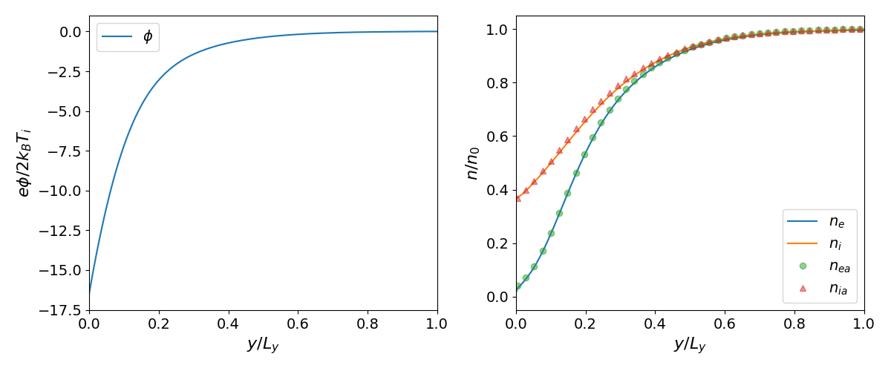
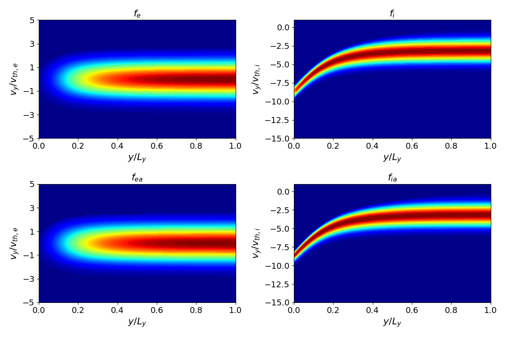

# 1D Plasma Sheath (Full Two-Species)

A **full two-species** (electron + ion) Vlasov-Poisson simulation of a plasma sheath forming at a floating wall. Both species are evolved with the Vlasov equation; electrons are reflected by the sheath electric field while ions are accelerated toward the wall.

## Physics

- **Domain**: $[0, 20] \times [0, 20]$ in $(x, y)$
- **Wall**: at $y = 0$, biased to the floating potential $\phi_w = -\ln\sqrt{m_i / (2\pi m_e)}$
- **Normalization**: $T_e = 1$, $T_i = 0.1$, $m_i/m_e = 2 \times 1836$
- **Boundary conditions**: Periodic in $x$, Bohm sheath inflow/outflow in $y$
- **Initial distribution**: Maxwellian for both species
- **1st-order immersed interface Poisson solver**

## Build

```bash
cmake -B build && cmake --build build
```

## Run

```bash
build/sheath examples/sheath/input.ini
```

## Analysis

```bash
python examples/sheath/plottings.py        # 1D line plots
python examples/sheath/sheath.py            # ODE comparison with scipy
```

## Results






Near the wall ($y \to 0$), the potential drops sharply, electrons are repelled, and ions are accelerated to the Bohm velocity. The charge density shows the characteristic positive space-charge region at the sheath edge.

The `sheath.py` script also solves the 1D sheath ODE using `scipy.integrate.solve_bvp` for code-to-code comparison against a semi-analytic Bohm sheath model.
