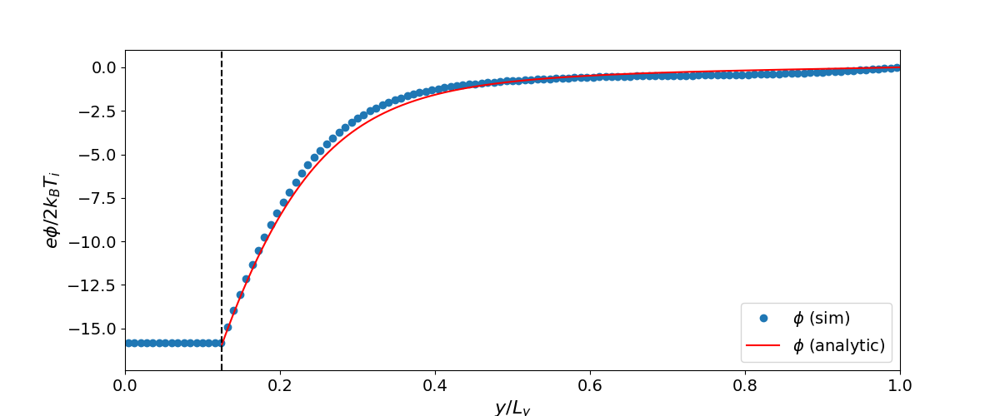

# 1D Kinetic Sheath (Full Two-Species)

A **full two-species** (electron + ion) Vlasov-Poisson simulation of a 1D kientic sheath forming at a dielectric wall. Both species are evolved with the Vlasov equation.

## Physics

- **Domain**: $[0, 20] \times [0, 20]$ in $(x, y)$
- **Dielectric slab**: at from $y=0$ up to $y / \lambda_D = 2.5$, with $\epsilon=4$. It absorbs plasma and accumulates surface charge
- **Normalization**: $T_i/T_e = 0.1$ and $m_i/m_e = 2 \times 1836$
- **Boundary conditions**: Periodic in $x$, Bohm sheath inflow/outflow in $y$

## Build

```bash
cmake -B build && cmake --build build --target sheath_kinetic
```

## Run

```bash
build/sheath_kinetic examples/sheath_kinetic/input.ini
```

## Analysis

```bash
python examples/sheath_kinetic/plottings.py
python examples/sheath_kinetic/make_anime.py
```

## Results


