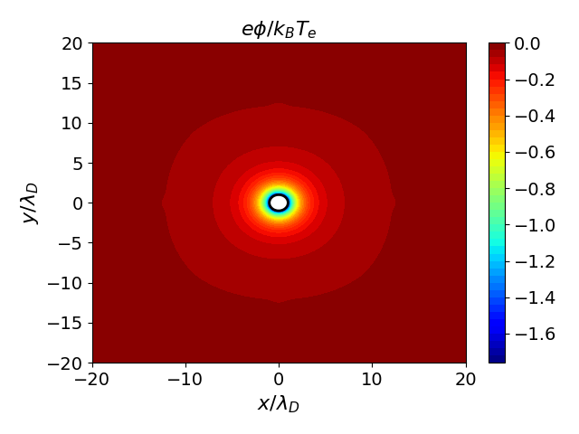
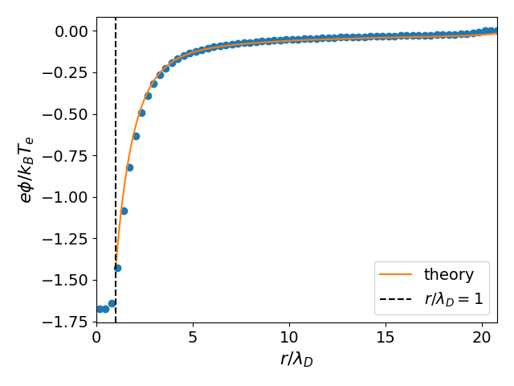

# 2D Orbital-MotionLimited (OML) Sheath (Full Two-Species)

A **full two-species** (electron + ion) Vlasov-Poisson simulation of a plasma sheath forming around a circular dielectric dust.

## Physics

- **Domain**: $[-20, 20]\lambda_D \times [-20, 20]\lambda_D$ in $(x, y)$
- **Normalization**: $T_i/T_e = 1$, $m_i/m_e = 100$
- **Boundary conditions**: Maxwellian injection and Dirichlet potential (fixed to 0) at 4 walls.
- **Initial distribution**: Maxwellian for both species
- **Charging dust**: Dust is dielectric with $\epsilon=5$ and surface charge accumulates as it absorbs plasma.

## Build

```bash
cmake -B build && cmake --build build --target sheath_oml
```

## Run

```bash
build/sheath_oml examples/sheath_oml/input.ini
```

## Analysis

```bash
python examples/sheath/plottings.py
python examples/sheath/make_anime.py
```

## Results




