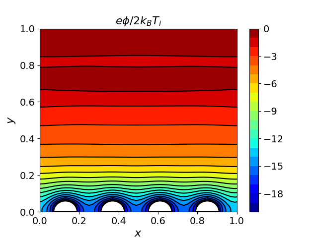
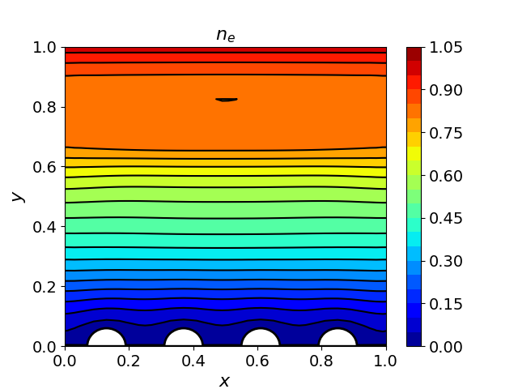

# Plasma Sheath with Rough (Corrugated) Wall

A two-species Vlasov-Poisson simulation of a plasma sheath adjacent to a rough wall with four hemispherical bumps. Demonstrates how non-planar geometry affects the sheath structure.

## Physics

- **Domain**: $[0, 20] \times [0, 20]$
- **Wall geometry**: Four hemispherical bumps along the bottom boundary:
  - Radius: $0.06 L_x$, spacing: $0.24 L_x$, starting from $x = 0.13 L_x$
  - Interior permittivity: 1000 (dielectric solid)
- **Wall potential**: $\phi_w = -4$ (fixed Dirichlet)
- **Top boundary**: $\phi = 0$ (Dirichlet)
- **Left/right**: Periodic
- **Grid**: $50 \times 100$ spatial, $50 \times 50$ velocity
- **1st-order immersed interface Poisson solver**

## Build

```bash
cmake -B build && cmake --build build
```

## Run

```bash
build/sheath_rough_wall examples/sheath_rough_wall/input.ini
```

## Analysis

```bash
python examples/sheath_rough_wall/plottings.py
```

## Results





The sheath contours follow the bump geometry rather than forming a planar layer. The potential isosurfaces curve around each protrusion, and the charge density shows localized enhancement near the bump tips. Compare with the flat-wall sheath example to see the geometric effect.
