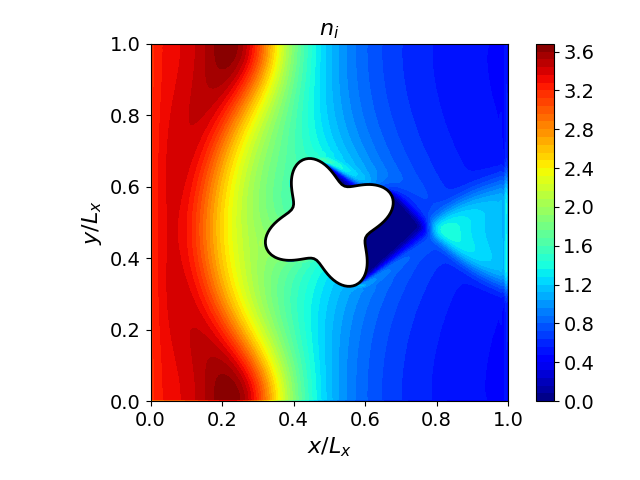
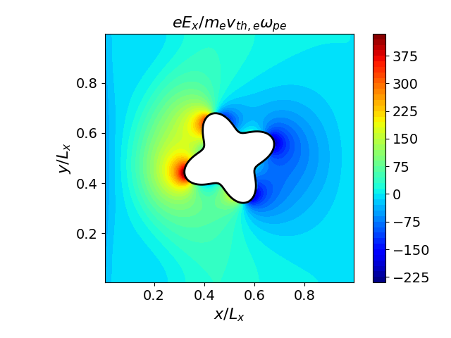

# Plasma Flow Past a Star-Shaped Dielectric Obstacle

A Vlasov-Poisson simulation of a plasma flowing past a 4-pointed star-shaped dielectric obstacle. Uses the reduced model (single ion species with Boltzmann electrons) and the 2nd-order Poisson solver.

## Physics

- **Domain**: $[0, 1] \times [0, 1]$
- **Obstacle**: Star shape centered at $(0.5, 0.5)$, defined by:
  $$\phi(x,y) = r - (0.15 + 0.04 \sin(4\theta))$$
- **Interior permittivity**: 1000 (dielectric star), exterior: 1 (plasma)
- **Star potential**: $\phi = -10/0.3 \approx -33.3$ (fixed Dirichlet)
- **Boundary conditions**: Ions injected from the left, reflective top/bottom, zero-inflow at right, Neumann at top/bottom
- **Grid**: $128 \times 128$ spatial, $100 \times 50$ velocity, runs 1,000 steps

## Build

```bash
cmake -B build && cmake --build build
```

## Run

```bash
build/star examples/star/input.ini
```

## Analysis

```bash
python examples/star/plottings.py
python examples/star/make_anime.py   # generate star.mp4
```

## Results






A wake forms behind the star, visible in the number density depletion downstream. The electric field is strongest at the star tips where curvature is highest.

The `star.mp4` animation shows the time evolution of number density, potential and electric field.
